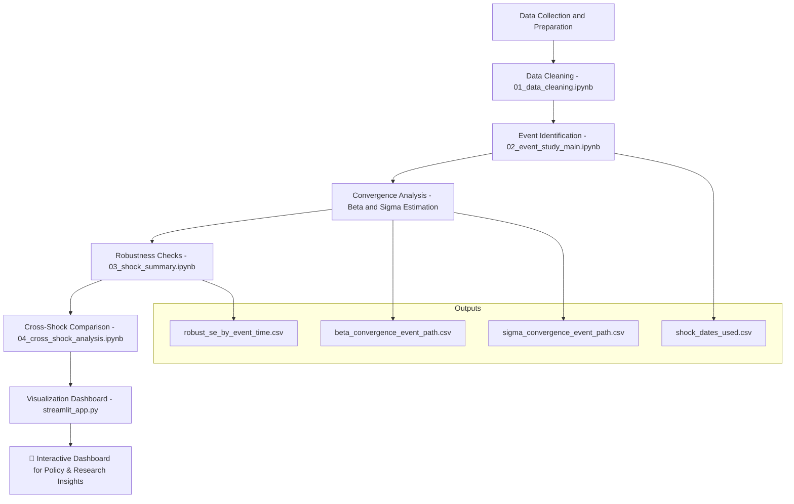

# 🥦 Event Study on Vegetable Price Shocks

This repository presents an **event-study analysis** of how Indian vegetable prices adjust after major price shocks.  
The project investigates **β- and σ-convergence**, estimates **half-lives of price shocks**, and visualizes results through an interactive **Streamlit dashboard**.

---

## 🎯 Research Motivation & Results

Vegetables, due to their perishable nature, contribute to short-term spikes in inflation, which is a key challenge for inflation management in India. Understanding the dynamics of price adjustment helps policymakers and market analysts stabilize short-term volatility while maintaining market efficiency.

## 📊 Key Results  

| Metric | Observation | Interpretation |
|--------|------------|----------------|
| **β-convergence** | Became more negative post-shock | Prices adjust faster after shocks |
| **Half-life of shocks** | ~12 months pre-shock → ~6 months post-shock | Market returns to equilibrium faster |
| **σ-convergence** | Temporary increase post-shock | Short-run volatility rises |
| **Statistical Significance** | Cluster and HAC robust SEs | Results are statistically robust |
  

📌 **Policy Insight:** Shocks accelerate convergence but amplify short-term volatility. Stabilization policies should focus on reducing short-run price fluctuations without distorting long-term market behavior.

---
## 🔮 Future Scope

- Extend analysis to other perishable commodities (e.g., fruits, dairy).

- Integrate real-time price feeds for predictive shock detection.

- Apply machine learning models for forecasting shock magnitude and duration.

- Explore macroeconomic implications of food price volatility on inflation and supply chain planning.

---

## 🔄 Workflow  

### Step-by-step Process

1. **Data Cleaning (`01_data_cleaning.ipynb`)**  
   - Loads and preprocesses `clean_panel.csv`.  
   - Handles missing values and standardizes time columns.  

2. **Event Identification (`02_event_study_main.ipynb`)**  
   - Detects vegetable price shocks based on volatility thresholds.  
   - Saves `shock_dates_used.csv`.

3. **Convergence Analysis**  
   - Estimates **β-convergence** and **σ-convergence** across states.  
   - Generates `beta_convergence_event_path.csv` and `sigma_convergence_event_path.csv`.

4. **Robustness Checks (`03_shock_summary.ipynb`)**  
   - Tests with **HC1**, **Clustered**, and **HAC** standard errors.  
   - Stores results in `robust_se_by_event_time.csv`.

5. **Cross-Shock Analysis (`04_cross_shock_analysis.ipynb`)**  
   - Compares multiple shocks to study heterogeneity across time.  

6. **Visualization (`streamlit_app.py`)**  
   - Interactive dashboard with:
     - β and σ plots with shock markers  
     - Robustness comparison  
     - Shock timeline visualization  

---

## 🧭 Workflow Diagram



---

## ⚙️ Installation & Setup  

1. Clone the repository:  
   ```bash
   git clone https://github.com/your-username/Event-Study-on-Vegetable-Price-Shocks.git
   cd Event-Study-on-Vegetable-Price-Shocks
   ```

2. Create a virtual environment:  
   ```bash
   python -m venv venv
   source venv/bin/activate     # On Windows: venv\Scripts\activate
   ```

3. Install dependencies:  
   ```bash
   pip install -r requirements.txt
   ```

4. Run the event study (optional):  
   ```bash
   python output/event_study_outputs/event_study.py
   ```

5. Launch the Streamlit dashboard:  
   ```bash
   streamlit run streamlit_app.py
   ```

---

## 🛠️ Tech Stack  

| Category | Tools |
|-----------|--------|
| Language | Python |
| Data Handling | pandas, numpy |
| Statistical Modeling | statsmodels, scikit-learn |
| Visualization | Plotly, Matplotlib |
| Dashboard | Streamlit |
| Documentation | Markdown, Mermaid |

---

## 🧾 Created By  

**Rohit Gupta**  
📧 rohitg2801@gmail.com
